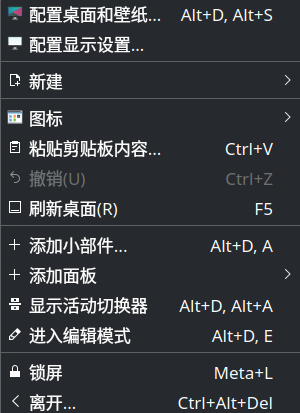
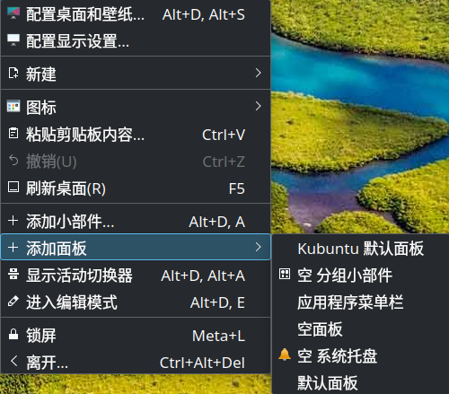

[//]: # ({"name":"将 KDE 装饰为 macOS 风格","author":"Mike Liu","tag":["theme","os"],"license":"CC-BY 4.0"})


macOS 以其 Aqua 桌面的多种特效和能给人深刻印象的交互设计在图形用户界面体验史上画下了浓墨重彩的一笔，而 Qt 则用优雅的设计模式和组件化的设计风格得到了程序员的青睐。鉴于 Qt 提供的高可伸缩性，我们可将基于 Qt 的 KDE 桌面环境配置仿 macOS 桌面的风格和特效，并无须编写任何代码。
## 摒弃传统类 Windows 任务栏，更换拿铁停靠栏（ latte-dock ）


拿铁停靠栏

安装拿铁停靠栏（ latte-dock ），执行下列命令：
```bash
apt install latte-dock
```

删除原先的任务栏。右键原先的任务栏，点击进入编辑模式，点击更多选项，点击删除面板，即可删除原先的任务栏。

## 设计 macOS 风格的顶部菜单栏





右键桌面，选择「添加面板」，再点击「空面板」创建一个新的空面板。

对新建的面板进行如图所示的设计。


